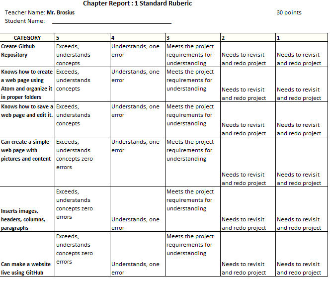

# Module 1
<h3>Introduction into Web Design</h3>

<h3>Objective</h3>

This unit will give you a basic understanding of core design principles that apply to web design and development. It will help you to establish criteria for evaluating the quality of websites, introduce you to color theory and web design standards, and introduce you to the site planning concepts of developing a site plan.

Students should be able to do the following at the end of the module.
  1. Create a Github account and explain how to create a repository
  2. How to create a web page using Atom
  3. How to save a web page.
  4. Creating a simple web page with pictures and content. 
  5. Insert Images, headers, columns, tables, and paragraphs. 
  6. Making a website live through Github. 
  

